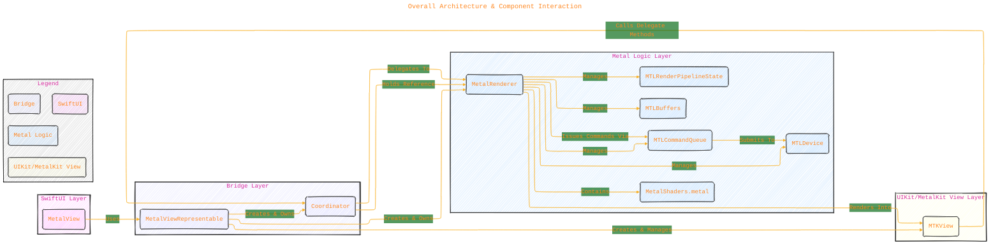
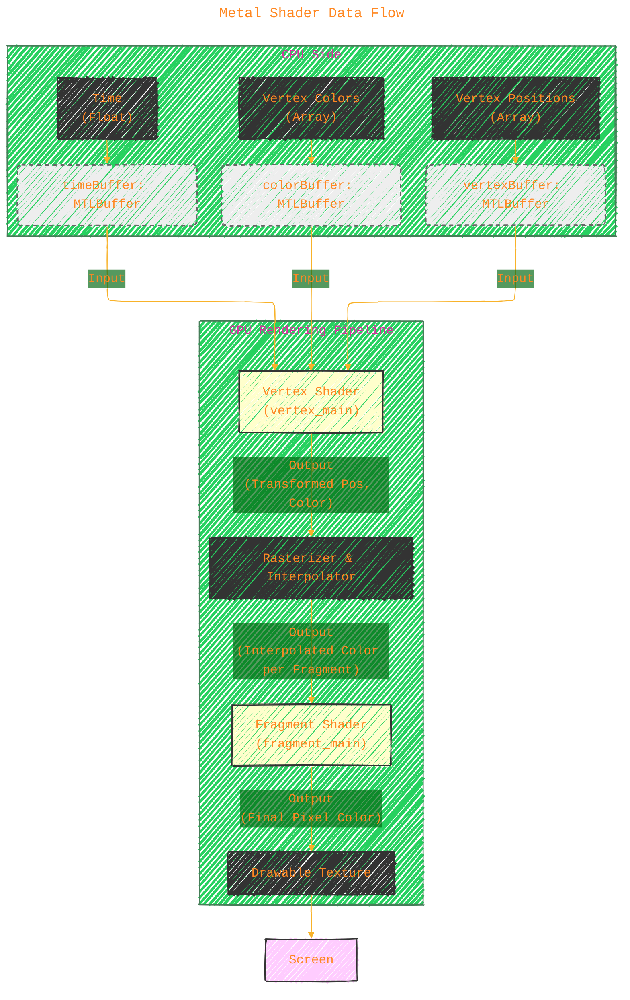
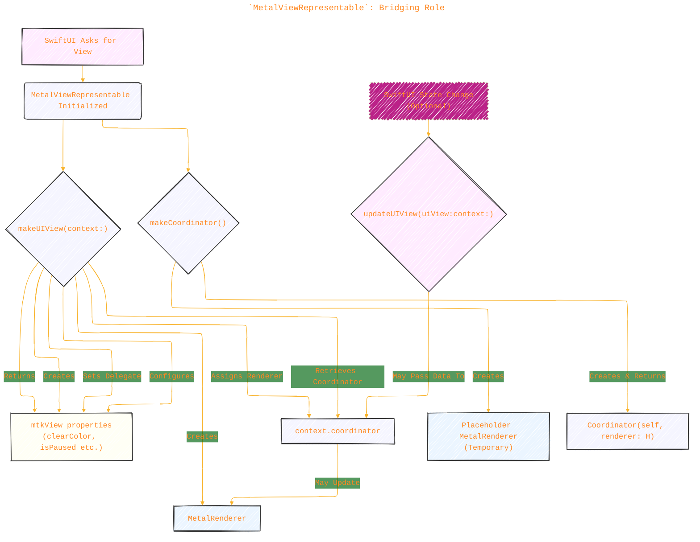

# A Diagrammatic Guide
> **Disclaimer:**
>
> This document contains my personal notes on the topic,
> compiled from publicly available documentation and various cited sources.
> The materials are intended for educational purposes, personal study, and reference.
> The content is dual-licensed:
> 1. **MIT License:** Applies to all code implementations (Swift, Mermaid, and other programming languages).
> 2. **Creative Commons Attribution 4.0 International License (CC BY 4.0):** Applies to all non-code content, including text, explanations, diagrams, and illustrations.
---

Let's break down this Swift code integrating Metal for rendering within a SwiftUI application.

**Overall Goal:** The code aims to display a simple, rotating triangle within a SwiftUI view. It achieves this by using Metal, Apple's framework for GPU programming, for the rendering logic and bridging it into the SwiftUI view hierarchy using `UIViewRepresentable`.

**Key Components:**

1.  **Metal Shaders (`metalShaderSource`):** GPU programs written in Metal Shading Language (MSL) that define how vertices are transformed (vertex shader) and how pixels are colored (fragment shader).
2.  **`MetalRenderer` Class:** Encapsulates the core Metal setup (device, command queue, pipeline state, buffers) and the drawing logic executed each frame.
3.  **`Coordinator` Class:** Acts as the `MTKViewDelegate`, receiving callbacks from the `MTKView` (like draw requests and size changes) and forwarding them to the `MetalRenderer`.
4.  **`MetalViewRepresentable` Struct:** A `UIViewRepresentable` that creates and manages an `MTKView` (a specific `UIView` subclass for Metal rendering) and its associated `Coordinator` and `MetalRenderer`, making it usable within SwiftUI.
5.  **`MetalView` Struct:** The main SwiftUI `View` that incorporates `MetalViewRepresentable` to display the Metal content.

Here's a collection of Mermaid diagrams illustrating the concepts and complexities:

----

## 1. Overall Architecture & Component Interaction

This diagram shows the high-level relationship between the SwiftUI parts, the bridge, the Metal logic, and the underlying view.

**Explanation:**

*   The `MetalView` (SwiftUI) includes the `MetalViewRepresentable` (Bridge).
*   `MetalViewRepresentable` is responsible for creating the `MTKView` (UIKit/MetalKit View), the `MetalRenderer` (Metal Logic), and the `Coordinator` (Bridge).
*   The `MTKView` notifies its delegate (`Coordinator`) when it needs to draw or resizes.
*   The `Coordinator` forwards these calls, primarily the draw call, to the `MetalRenderer`.
*   The `MetalRenderer` contains all Metal setup, shaders, and performs the drawing operations using the `MTLDevice`, `MTLCommandQueue`, `MTLRenderPipelineState`, and `MTLBuffers`, rendering the final image into the `MTKView`.

---

## 2. `MetalRenderer`: Initialization Sequence (`init?`)

This diagram shows the sequence of steps performed within the `MetalRenderer`'s initializer to set up the necessary Metal objects.

**Explanation:**

*   The initializer (`init?`) is called, usually from `MetalViewRepresentable`'s `makeUIView`.
*   It first obtains the default `MTLDevice`.
*   It creates a `MTLCommandQueue` for submitting work to the device.
*   It defines the triangle's vertex positions and colors in Swift arrays.
*   It creates `MTLBuffer` objects on the GPU to hold the vertex, color, and time data.
*   It compiles the embedded `metalShaderSource` string into a `MTLLibrary`.
*   It retrieves the compiled `vertex_main` and `fragment_main` functions from the library.
*   It configures a `MTLRenderPipelineDescriptor` specifying which shader functions to use and the format of the output texture (matching the `MTKView`).
*   Finally, it creates the `MTLRenderPipelineState` object, which represents the compiled shaders and fixed-function state (like blending) for a render operation. Failure at any `guard` step results in returning `nil`.

---

## 3. `MetalRenderer`: Render Loop Sequence (`draw(in:)`)

This diagram illustrates the steps taken every frame to draw the triangle.

**Explanation:**

*   The `MTKView` triggers the `draw(in:)` method on its delegate (`Coordinator`) for each frame.
*   The `Coordinator` delegates this call to the `MetalRenderer`.
*   The `Renderer` obtains essential objects for drawing:
    *   `currentDrawable`: The texture to draw into for this frame.
    *   `currentRenderPassDescriptor`: Describes how the drawing target (the drawable's texture) should be handled (e.g., clearing it).
    *   `commandBuffer`: A container for GPU commands for this frame.
    *   `renderCommandEncoder`: An object used to encode rendering-specific commands into the command buffer.
*   The `time` variable is updated on the CPU, and its value is written into the `timeBuffer` (accessible by the GPU).
*   Rendering state is set on the `renderEncoder`: the pipeline state (shaders) and the data buffers are bound to specific indices (`[[buffer(n)]]`) referenced in the vertex shader.
*   The `drawPrimitives` command tells the GPU to execute the vertex shader 3 times (for the 3 vertices of the triangle) and then the fragment shader for all pixels covered by the resulting triangle.
*   `endEncoding` finalizes the render commands.
*   `present(drawable)` schedules the completed frame to be displayed on screen.
*   `commit()` sends the entire command buffer to the GPU for execution.

---

## 4. Metal Shader Data Flow

This shows how data flows from CPU-defined buffers through the GPU's rendering pipeline stages.

**Explanation:**

*   **CPU Side:** Swift arrays containing vertex positions, colors, and the current time value are used to create and update `MTLBuffer` objects. These buffers reside in memory shared with or accessible by the GPU.
*   **GPU Pipeline:**
    *   **Vertex Shader (`vertex_main`):** Executes once per vertex (3 times for the triangle). It reads the vertex position, color, and the current time from the bound `MTLBuffers` (at indices 0, 1, and 2 respectively). It calculates the rotated position and passes the transformed position and original vertex color to the next stage.
    *   **Rasterizer & Interpolator:** Determines which pixels on the screen are covered by the triangle. For each covered pixel (fragment), it interpolates the values output by the vertex shader (in this case, the color) across the surface of the triangle.
    *   **Fragment Shader (`fragment_main`):** Executes once per fragment (pixel) covered by the triangle. It receives the interpolated color (`in.color`) and outputs it as the final color for that pixel.
    *   **Drawable Texture:** The output colors from the fragment shader are written into the `MTLDrawable`'s texture.
*   **Screen:** The GPU presents the completed drawable texture to the display.

---

## 5. `MetalViewRepresentable`: Bridging Role

This diagram focuses on the lifecycle and responsibilities of the `UIViewRepresentable` struct.

**Explanation:**

*   **`makeCoordinator()`:** Called first by SwiftUI. It creates the `Coordinator` instance. A *placeholder* `MetalRenderer` is created here just to satisfy the coordinator's initializer, but it's replaced later.
*   **`makeUIView(context:)`:** Called next. This is where the actual setup happens:
    *   The `MTKView` is created.
    *   The real `MetalRenderer` is initialized, passing the `MTKView` to it so the renderer knows about the view's properties (like `colorPixelFormat`).
    *   The `Coordinator` (accessed via `context.coordinator`) has its `renderer` property updated to the *real* renderer.
    *   The `Coordinator` is set as the `MTKView`'s delegate, establishing the link for callbacks (`draw(in:)`).
    *   The `MTKView` is configured (background color, drawing mode).
    *   The configured `MTKView` is returned to SwiftUI for display.
*   **`updateUIView(uiView:context:)`:** Called when SwiftUI state that `MetalViewRepresentable` depends on changes. This is the place to pass data *down* from SwiftUI to the Metal rendering logic, typically via the coordinator and renderer (though not used in this specific example).

---
**Licenses:**

- **MIT License:**   - Full text in [LICENSE](LICENSE) file.
- **Creative Commons Attribution 4.0 International:**  - Legal details in [LICENSE-CC-BY](LICENSE-CC-BY) and at [Creative Commons official site](http://creativecommons.org/licenses/by/4.0/).

---