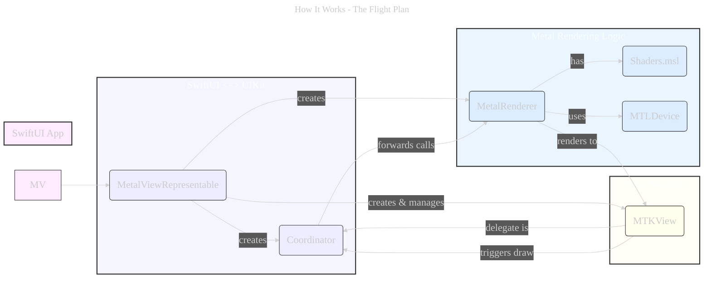

# PrismPilot 🚀 

  

  

---
Copyright (c) 2025 Cong Le. All Rights Reserved.

---

Welcome to **PrismPilot**! This project is a straightforward demonstration of embedding a custom Metal rendering canvas directly within a SwiftUI application. It showcases a simple, rotating, colored triangle, serving as a clear and concise starting point for developers looking to combine the declarative power of SwiftUI with the high-performance graphics capabilities of Metal.

Think of it as your first guided flight into mixing these two powerful Apple frameworks!

**(Add a GIF or Screenshot here showing the rotating triangle in action!)**
 <!-- Remember to replace placeholder.gif -->

---

## ✨ Key Concepts Demonstrated

PrismPilot is designed to clearly illustrate several core techniques:

*   **SwiftUI <-> UIKit Bridge:** Using `UIViewRepresentable` to host an `MTKView` (from MetalKit/UIKit) within a SwiftUI view hierarchy.
*   **MetalKit View Setup:** Basic configuration of an `MTKView` for Metal rendering.
*   **Delegate Pattern:** Implementing the `MTKViewDelegate` protocol using a `Coordinator` class to handle draw loop callbacks and view resizing.
*   **Core Metal Initialization:** Setting up essential Metal objects:
    *   `MTLDevice` (GPU access)
    *   `MTLCommandQueue` (Submitting work)
    *   `MTLRenderPipelineState` (Compiled shaders and render configurations)
*   **Metal Shaders (MSL):** Writing basic vertex and fragment shaders directly in Swift as strings (or easily refactored to `.metal` files).
*   **Data Buffers:** Creating `MTLBuffer` objects to send vertex data (positions, colors) and uniform data (like time for animation) from the CPU to the GPU.
*   **Simple Animation:** Passing a time uniform to the vertex shader to perform a basic rotation.
*   **Render Loop:** Understanding the fundamental steps in the `draw(in:)` method: obtaining a drawable, creating command buffers/encoders, setting pipeline state, binding buffers, issuing draw calls, and committing work.

---

## 🔧 How It Works - The Flight Plan

At its heart, PrismPilot follows this flow:

1.  **SwiftUI (`MetalView`):** The top-level view declares it wants to show our Metal content.
2.  **The Bridge (`MetalViewRepresentable`):** This struct acts as the translator. It knows how to create and manage a UIKit-based `MTKView`.
3.  **The Coordinator (`Coordinator`):** This helper object acts as the `MTKView`'s delegate. It listens for events like "It's time to draw a new frame!" or "The view size changed!".
4.  **The Engine (`MetalRenderer`):** This class holds all the Metal-specific setup (like connecting to the GPU, loading shaders, preparing data buffers) and contains the logic for *actually* drawing the triangle each frame.
5.  **The Canvas (`MTKView`):** This spécial UIKit view provides the surface onto which Metal draws pixels.
6.  **The GPU (via Metal):** The `MetalRenderer` sends commands (using shaders and data buffers) through Metal to the GPU, which performs the heavy lifting of calculating vertex positions and pixel colors.

The `Coordinator` links the `MTKView`'s requests back to the `MetalRenderer`, completing the loop.

----

## 🚀 Getting Started

You can run PrismPilot yourself:

1.  **Clone:** `git clone <your-repo-url>`
2.  **Open:** Launch the `.xcodeproj` or `.swiftpm` package file in Xcode.
3.  **Run:** Build and run the project on an iOS simulator or a physical device.

*(Requires Xcode and basic familiarity with Swift/iOS development).*

---

## ⚙️ Code Breakdown

*   **`MetalView.swift`:** The main SwiftUI `View` struct that embeds the `MetalViewRepresentable`.
*   **`MetalViewRepresentable.swift`:** The crucial `UIViewRepresentable` struct that creates and configures the `MTKView`, `MetalRenderer`, and `Coordinator`.
*   **`Coordinator.swift`:** The `NSObject` subclass conforming to `MTKViewDelegate`, linking the `MTKView`'s lifecycle to the `MetalRenderer`.
*   **`MetalRenderer.swift`:** The core class managing Metal setup (`MTLDevice`, `MTLCommandQueue`, `MTLRenderPipelineState`, `MTLBuffer`s) and handling the frame-by-frame drawing logic in `draw(in:)`.
*   **`metalShaderSource` (String constant):** Contains the Metal Shading Language (MSL) code for the vertex and fragment shaders.

---

## 🔧 Next Steps & Exploration

PrismPilot is intentionally simple. Here are some ideas to build upon it:

*   **Refactor Shaders:** Move the `metalShaderSource` string into a separate `.metal` file for better syntax highlighting and organization.
*   **More Complex Geometry:** Draw a cube, sphere, or load a model instead of just a triangle.
*   **Texturing:** Apply an image texture to the geometry.
*   **Camera & Projection:** Implement a camera system and projection matrix for 3D perspective.
*   **User Interaction:** Pass touch input from SwiftUI down to the Metal renderer to manipulate the scene.
*   **Lighting:** Add basic lighting calculations to the shaders.
*   **Performance:** Explore optimizations for more complex scenes (e.g., managing buffer updates efficiently).

---

## ❤️ Contributing

Found a bug or have an improvement? Feel free to open an issue or submit a pull request! Contributions are welcome.

---

## 📜 License

- **MIT License:**   - Full text in [LICENSE](LICENSE) file.
- **Creative Commons Attribution 4.0 International:**  - Legal details in [LICENSE-CC-BY](LICENSE-CC-BY) and at [Creative Commons official site](http://creativecommons.org/licenses/by/4.0/).

---

[Back to Top](#top)

